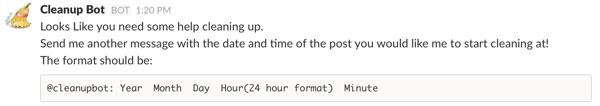
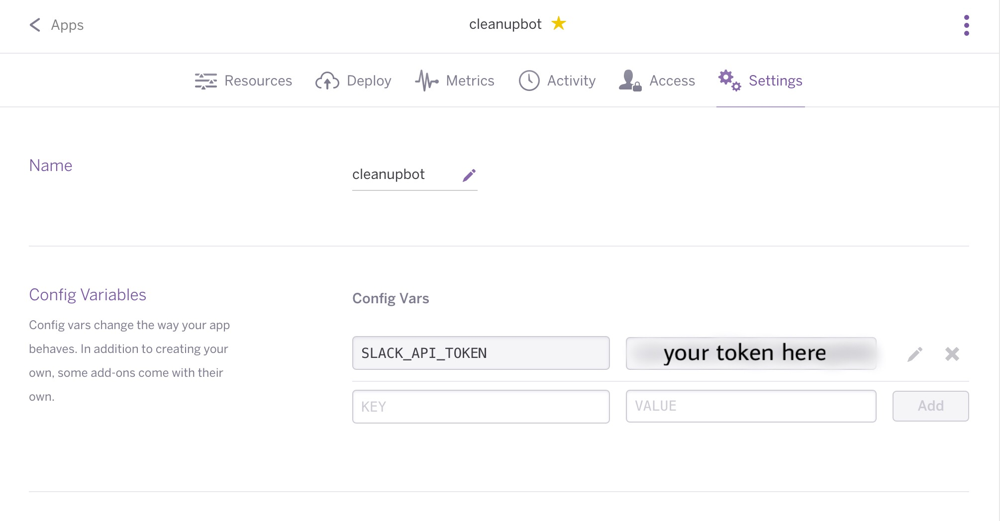

# cleanupbot
A neat little slack extension to archive and comment on past chats

---
### Use Cases: 
Your company uses a slack channel for customer relations, standups, or other important operational needs. How does one quickly archive and reference these chats for later use? 

### Solution: 
Cleanupbot is an extension that allows you to specify a point in time to turn the chat history from that point on into a post. These posts can then be commented on to add further information or context to the chat. These posts are easily searchable and easily referenced to add or extract important information from the chat

---

### Use It On Your Slack!
Note: This is still in development, but feel free to download this yourself and play around with it
##### To Download:
`git clone https://github.com/scottweitzner/cleanupbot.git` 

The bot runs on a heroku server (I just use the free tier). In order to download this on your account you'll need to initialize a heroku server from the toolbelt. The slack API token must be added to the environment variables in heroku which can be doen by going to 

